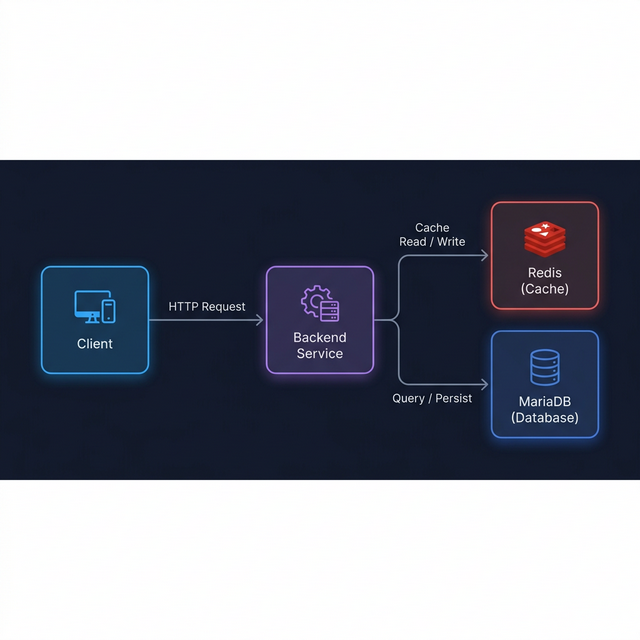

# bus-booking-system

The Bus Booking System

## Functional Requirements

### FR-01: Search Trips

**Description:** Users can search for available trips by specifying a travel date and the number of seats required.

**Acceptance Criteria:**

- The system provides a search form with at minimum the following fields:
  - Travel date (required)
  - Number of seats needed (required, minimum 1)
- The system returns a list of trips matching the search criteria.
- If no trips match the criteria, the system displays an appropriate "no results found" message.

---

### FR-02: View Trip List

**Description:** Users can view all trips in the system, including both available and fully booked trips.

**Acceptance Criteria:**

- Each trip entry displays the following information:

  | Field           | Description                                     |
  | --------------- | ----------------------------------------------- |
  | Origin          | Departure point                                 |
  | Destination     | Arrival point                                   |
  | Date & Time     | Scheduled departure date and time               |
  | Total Seats     | Total number of seats on the vehicle            |
  | Available Seats | Number of seats not yet booked                  |
  | Booked Seats    | Number of seats already reserved                |
  | Seat Numbers    | Individual seat identifiers (e.g., A1, A2, B1…) |

- Fully booked trips are still displayed but are visually distinguished (e.g., labeled "Sold Out").
- Available seats and unavailable seats are clearly differentiated in the seat map.

---

### FR-03: Select Seats

**Description:** Users can select one or more available seats for a trip.

**Acceptance Criteria:**

- The system displays a visual seat map for each trip.
- Only available seats can be selected.
- When a user selects a seat:
  - The seat is visually dimmed/highlighted to indicate it has been chosen.
  - The seat is marked as **"Selected"** in the UI.
- Users can deselect a previously selected seat to make it available again.
- The total number of selected seats and their seat numbers are summarized for the user before proceeding to payment.

---

### FR-04: Payment & Booking Completion

**Description:** Users can pay for their selected seats to finalize the booking.

**Acceptance Criteria:**

- A payment screen is presented after seat selection, showing:
  - Selected seat numbers
  - Total amount to be paid
- The user can proceed with payment using a supported payment method.
- The booking is only confirmed after successful payment processing.
- Users cannot book a seat without completing payment.

---

### FR-05: Booking Confirmation & Error Notification

**Description:** The system provides feedback to the user after a booking attempt.

**Acceptance Criteria:**

- **On success:**
  - The system records the booking and marks the selected seats as booked.
  - A success notification is displayed to the user, including:
    - Booking reference/ID
    - Trip details (origin, destination, date & time)
    - Confirmed seat numbers
- **On failure:**
  - The system displays a clear error message describing the reason for failure (e.g., payment declined, seats no longer available).
  - Selected seats are released back to available status if payment fails.
  - The user is given the option to retry or cancel.

---

## System Design



---

## 🐳 Docker Infrastructure

The `docker/` folder contains a `docker-compose.yml` that spins up the infrastructure services needed for local development.

### Services

| Service           | Image                                   | Port   | Description                   |
| ----------------- | --------------------------------------- | ------ | ----------------------------- |
| `mariadb`         | `mariadb:11`                            | `3306` | Primary database              |
| `redis`           | `redis:7-alpine`                        | `6379` | Cache store                   |
| `adminer`         | `adminer:latest`                        | `8090` | Web-based DB admin UI         |
| `redis-commander` | `rediscommander/redis-commander:latest` | `8091` | Web-based Redis management UI |

### Prerequisites

- [Docker Desktop](https://www.docker.com/products/docker-desktop/) installed and running

### Start infrastructure

```bash
cd docker
docker compose up -d
```

### Stop all services

```bash
cd docker
docker compose down
```

### Remove all services and data volumes

```bash
cd docker
docker compose down -v
```

---

## 🗄️ Using Adminer (DB Admin UI)

Adminer is a lightweight web interface to manage the MariaDB database.

**Access URL:** [http://localhost:8090](http://localhost:8090)

**Login credentials:**

| Field    | Value         |
| -------- | ------------- |
| System   | `MySQL`       |
| Server   | `mariadb`     |
| Username | `bususer`     |
| Password | `buspassword` |
| Database | `bus_booking` |

> **Tip:** Use `root` / `rootpassword` as username/password if you need full admin access.

---

## 🔴 Using Redis Commander (Redis Management UI)

Redis Commander is a lightweight web interface for browsing, editing, and managing keys in the Redis cache.

**Access URL:** [http://localhost:8091](http://localhost:8091)

> No login credentials required — Redis Commander connects automatically to the `bus-redis` container.

### What you can do with Redis Commander

| Feature                  | Description                                                        |
| ------------------------ | ------------------------------------------------------------------ |
| **Browse keys**          | View all Redis keys with their types, TTL, and values              |
| **Search / filter keys** | Use the search bar to filter keys by pattern (e.g. `session:*`)    |
| **Inspect values**       | Click any key to inspect its value (String, Hash, List, Set, ZSet) |
| **Edit values**          | Update a key's value directly from the UI                          |
| **Delete keys**          | Remove individual keys or flush entire databases                   |
| **Monitor TTL**          | See the remaining time-to-live for expiring keys                   |
| **Add new keys**         | Create new keys of any Redis data type                             |

### Common use-cases

- **Debug session/token data** — inspect session keys your Spring Boot backend stores in Redis.
- **Check cache hits** — verify that cached responses/objects are stored correctly.
- **Manually expire a key** — set TTL to `1` to force a key to expire immediately during testing.
- **Flush all data** — use the "Flush DB" button to wipe Redis state between test runs.

> **Tip:** To flush only one database (default is `db0`), click the database name in the left sidebar and use the **"Flush"** button.

---

## 🖥️ Frontend (React + Vite)

Frontend nằm trong thư mục `frontend-bus-booking-system/`, được xây dựng bằng **React** và **Vite**.

### Prerequisites

- **Node.js** >= 18 ([https://nodejs.org](https://nodejs.org))
- **npm** >= 9 (đi kèm với Node.js)

Kiểm tra version đã cài:

```bash
node -v
npm -v
```

### Cài đặt dependencies

```bash
cd frontend-bus-booking-system
npm install
```

### Chạy Development Server

```bash
cd frontend-bus-booking-system
npm run dev
```

Mở trình duyệt tại: [http://localhost:5173](http://localhost:5173)

> **⚠️ Lưu ý:** Backend Spring Boot phải đang chạy tại `http://localhost:8080` trước khi sử dụng tính năng search. Vite đã được cấu hình proxy tự động forward các request `/bus-booking/*` tới backend.

### Build Production

```bash
cd frontend-bus-booking-system
npm run build
```

File build sẽ được tạo trong thư mục `dist/`.

### Preview Production Build

```bash
cd frontend-bus-booking-system
npm run preview
```

### Cấu trúc thư mục

```
frontend-bus-booking-system/
├── index.html                  # Entry HTML
├── vite.config.js              # Vite config + proxy backend
├── package.json
└── src/
    ├── main.jsx                # React entry point
    ├── App.jsx                 # Main app (state + API)
    ├── index.css               # Design system (dark theme)
    └── components/
        ├── SearchForm.jsx      # Form tìm kiếm chuyến xe
        ├── TripResults.jsx     # Hiển thị kết quả + loading
        └── Pagination.jsx      # Phân trang
```
